# TUTORIAL GITHUB

**DAFTAR GITHUB**

\- Link : [[https://github.com/]](https://github.com/)

\- Daftar seperti biasa

**INSTALL GIT DI WINDOWS**

-   silahkan install dlu git di windows Link :
    > [[https://git-scm.com/download/win]](https://git-scm.com/download/win)
    > (pilih yg setup 64/32)

-   install seperti biasa

-   kalau berhasil klik kanan di desktop dan muncul **GIT BASH HERE**

> 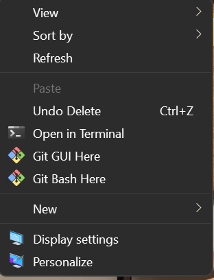

**\# Repository Tugas Praktikum Pengantar Pemrograman 2022**

**\## Alur pengumpulan tugas ke repositori ini**

Catatan: di bawah ini SS saat saya coba kumpul tugas di repository
LABPP_2022_5 , **karena kalian kelompok 7 jadi kumpul tugas nya di
repository LAB-WEB-7-2023**

1.  Fork repositori ini
    > [[https://github.com/Muhammadrizuki/LAB-WEB-7-2023]](https://github.com/Muhammadrizuki/LAB-WEB-7-2023)

-   Klik fork di kanan atas

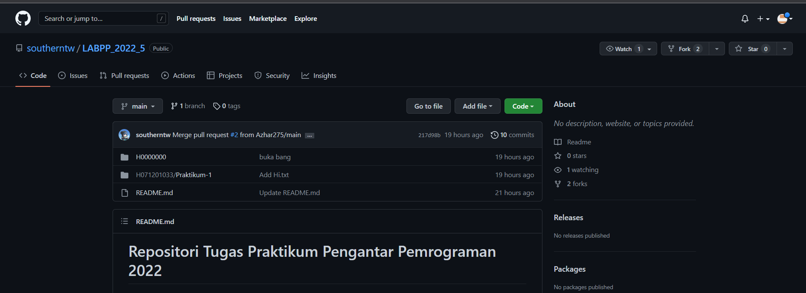

-   Setelah itu klik create fork

2.  **CLONE** repository hasil **fork** anda

-   klik kanan di desktop trus pilih GIT BASH HERE

**git clone
[[https://github.com/YOUR_USERNAME/LAB-WEB-7-2023.git]{.underline}](https://github.com/YOUR_USERNAME/LABPP_2022_5.git)**

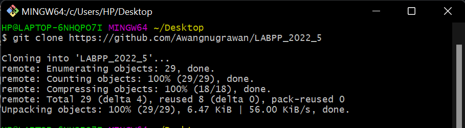{width="6.268055555555556in"
height="1.7236111111111112in"}

-   Klo sukses ntar ada folder baru sesuai nama repo yg di bikin tadi

-   kalau sudah ada keterangan done seperti SS di atas artinya sudah
    berhasil clone

-   Kemudian lihat desktop ( tampilan layar utama pada sistem operasi
    windows) nanti otomatis ada folder yang namanya sesuai repo tdi

> 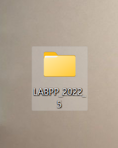{width="2.4479166666666665in"
> height="3.0729166666666665in"}

-   Skrng coba buka isi folder nya dan buat folder baru pake NIM anda

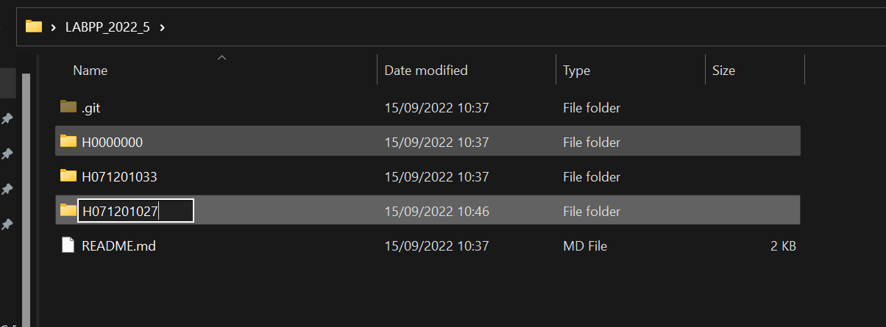{width="6.268055555555556in"
height="2.316666666666667in"}

Setelah itu buka foldernya dan bkin lagi folder baru dengan nama
praktikum

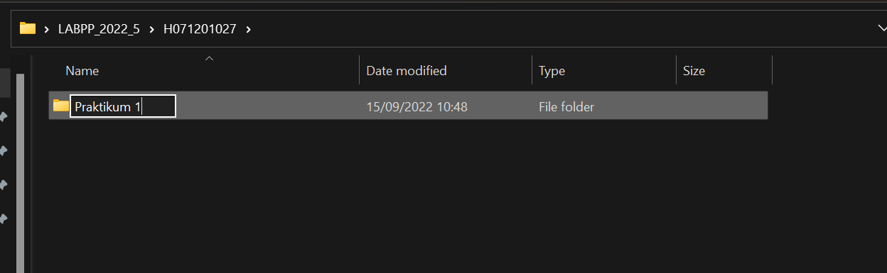

-   Lanjut coba buat file baru di dalam folder praktikum 1 tdi misal
    test.txt trus isi file nya bebas

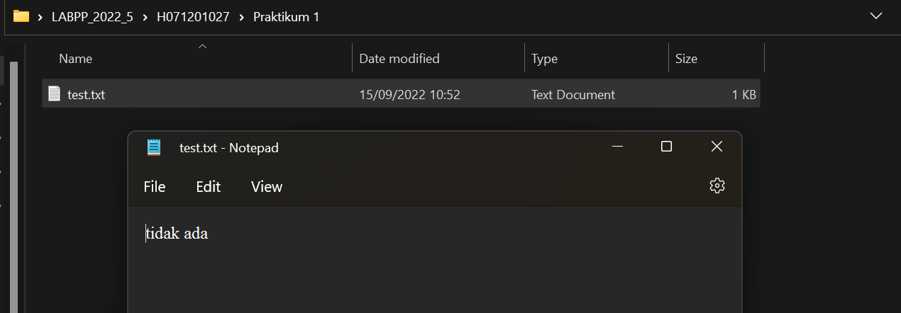

-   Klo udah, dari terminal yg tadi kita masuk ke foldernya ketik cd
    nama folder

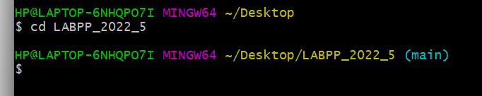

**PUSH FILE**

Pilih-pilih folder/file yang mau diupload

-   " git add . " =\> semua file baru/ yang ada perubahannya dalam
    folder yang skrng bakal di push

-   " git add tes.txt " =\> kalo mau upload file secara spesifik

Contoh

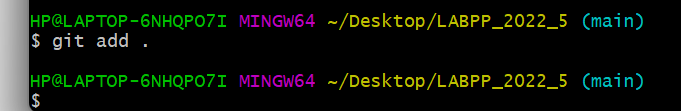

Artinya Semua file di folder tersebut bakal di push

Lakukan commit tiap kali nge-push (NB: commit artinya buat keterangan
kita push apa )

-   " git commit -m '(isi kommitnya)' "

Contoh :

-   " git commit -m "latihan" "

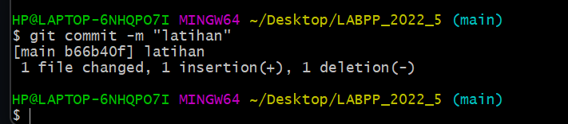

-   git push =\> fungsinya untuk upload ke git

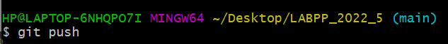

-   Akan muncul perintah untuk login , masukkan usernamenya kalian dan
    untuk password itu isinya adalah token

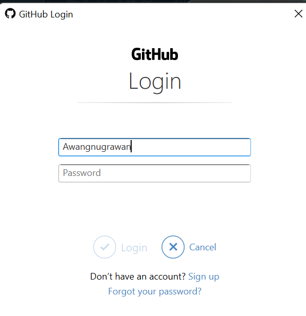

-   Untuk dapatkan token, klik profil 🡪 klik settings

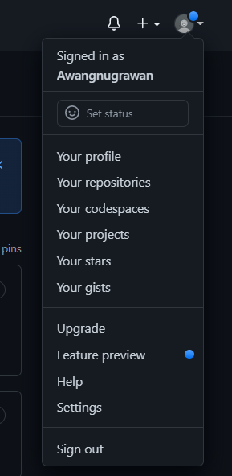

-   Terus scrool ke bawah klik developer settings

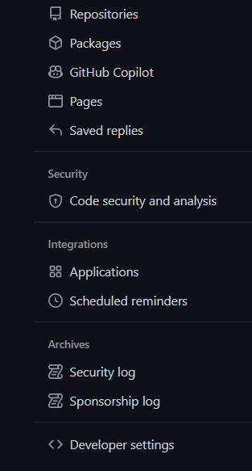

-   Klik bagian personal akses tokens dan generate new token

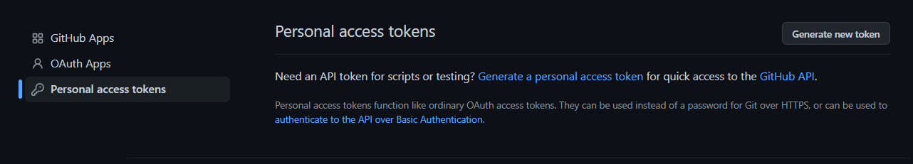

-   Pilih yang no expiration, supaya tiap mau uplod file tidak perlu
    login ulang lagi

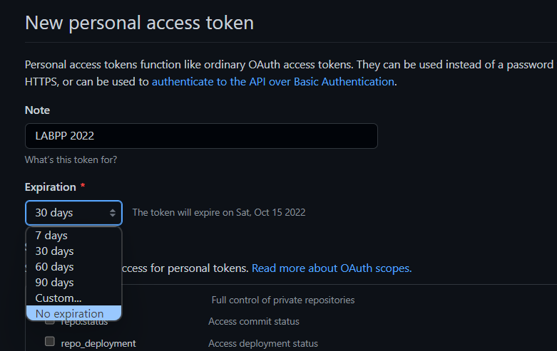

-   Centang repo

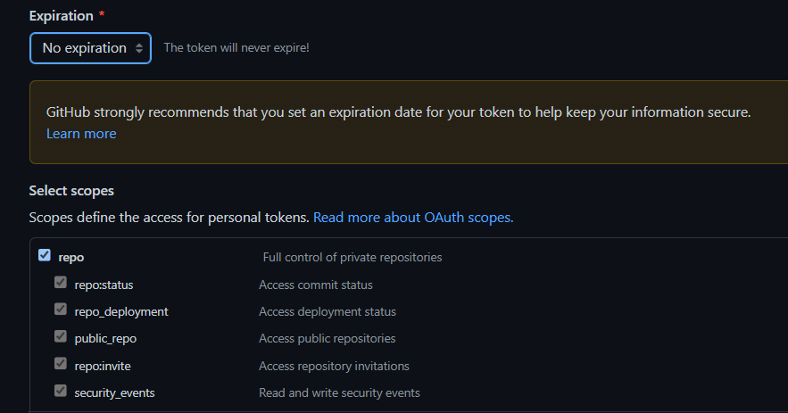

-   Scrool ke bawah dan klik generate token

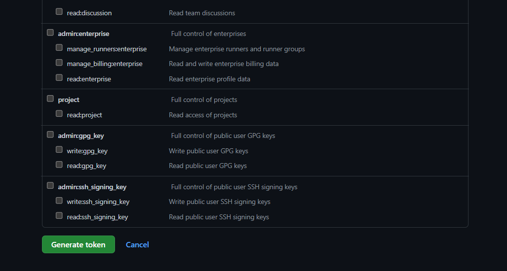

-   Copy tokennya untuk dimasukkan nanti dibagian password

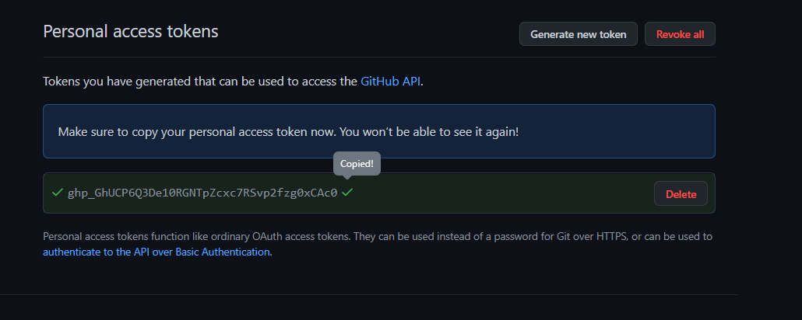

-   Kembali ke yang tadi disuruh login, paste token nya ke dalam
    password

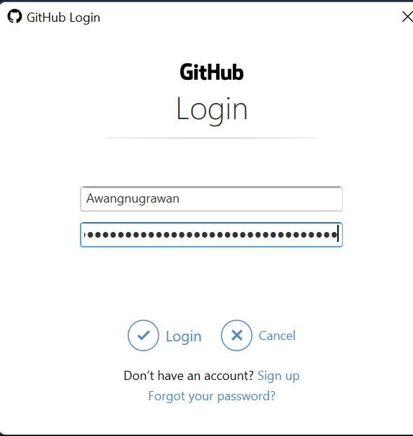

-   Isi usernamenya sesuai dgn yang ada di git , ini usernamenya sama ji
    kyak tdi

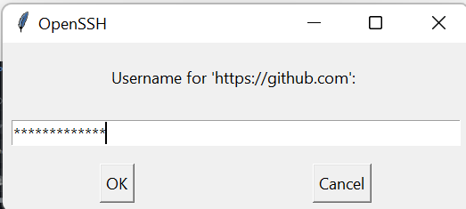

-   Tokennya juga sama kyk tdi paste ke password

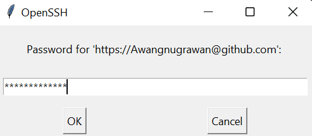

-   Setelah berhasil coba buka kembali cmd nya, kalau berhasil muncul
    seperti di bawah ini, 100%

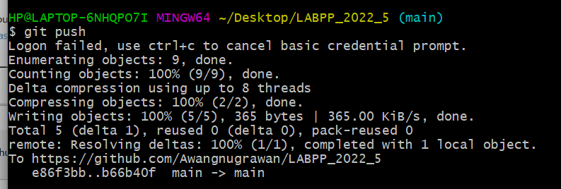

-   Setelah di git push itu artinya sudah terkirim ke github, sekarang
    kembali ke halaman github, terus klik pull request

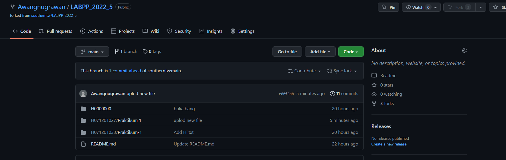

-   Klik yang di sebelah kanan, new pull request

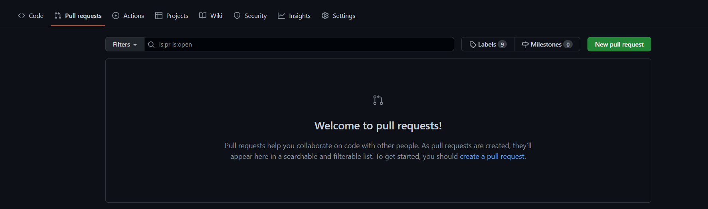

-   Lanjut, klik lagi create pull request

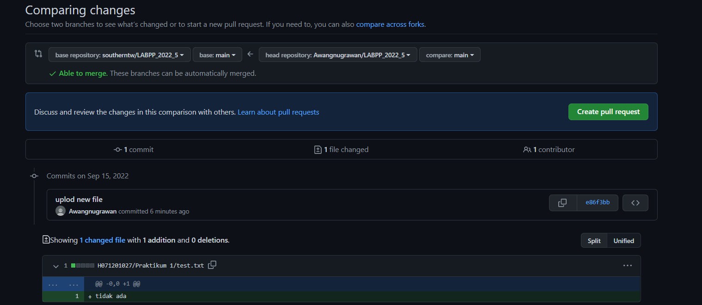

-   Lanjut, klik lagi create pull request. Jika mau tambahkan coment
    bisa juga

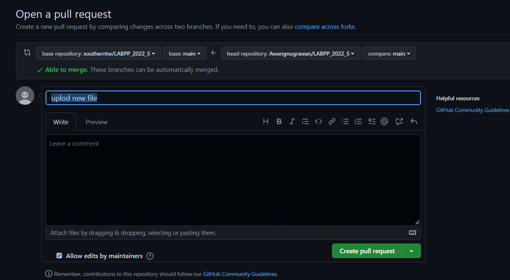

-   Nah kalau sudah selesai akan muncul tampilan seperti di bawah,
    artinya sudah di serahkan tinggal tunggu untuk saya nilai dan acc

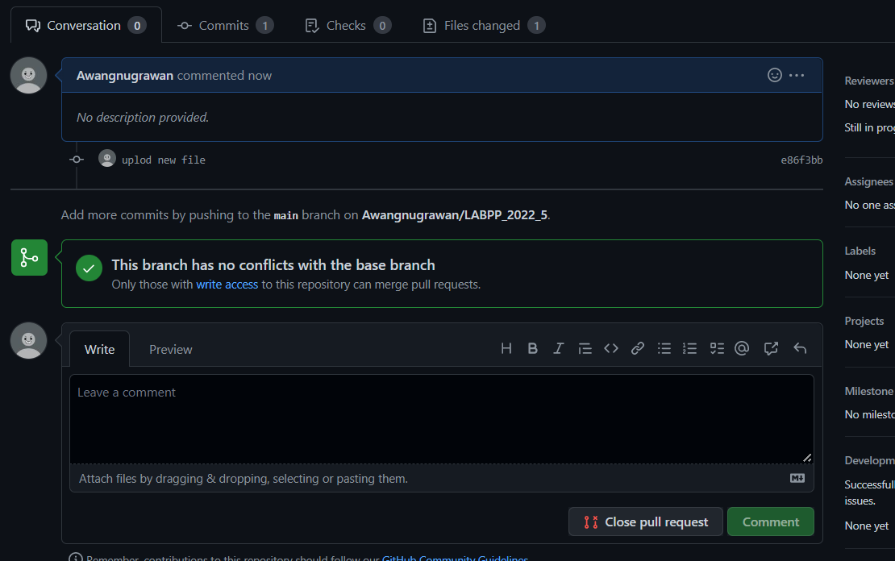

**\## Hal-hal yang harus diperhatikan**

\- \[x\] Cara mengumpulkan tugas sesuai dengan aturan diatas.

\- \[x\] \_\*\*Satu Praktikum, Satu Folder\*\*\_.

\- \[x\] \_\*\*Satu Soal, Satu Class\*\*\_.

\- \[x\] \_\*\*Program Berjalan dengan Baik dan Benar Berdasarkan
Ketentuan Tugas\*\*\_.
